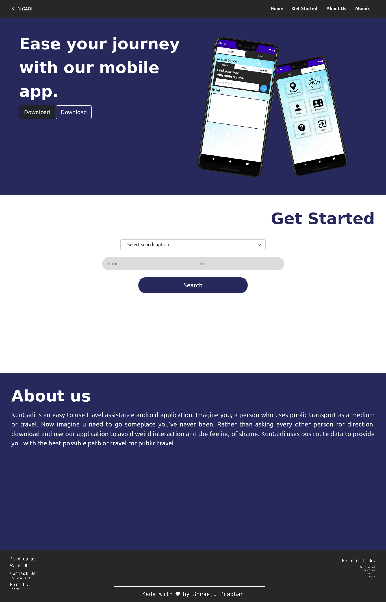
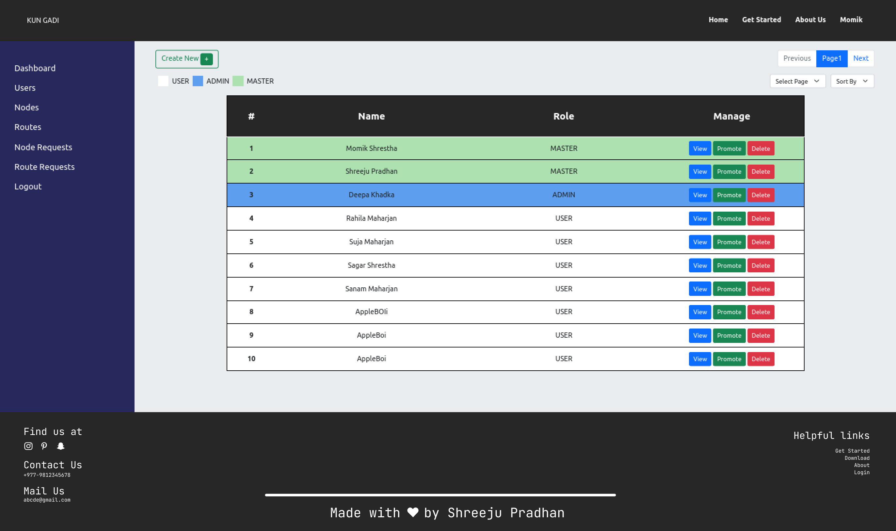

# 6th Semester Major Project
- By <a href="github.com/PG-Momik">Momik Shrestha</a>
- By <a href="github.com/shreejupradhan">Shreeju Pradhan</a>

# Kun-Gadi Web Application
- Primarily for Admin dashboard to interact with data

# Features
- Interactive Map.
- Allows end user to look up routes without login.
- Responsive(little).
- Dashboard for simple analytics.
- Add new nodes, routes and users.
- Review node and route contributions.
- Approve node and route contributions.
- Update and delete users, nodes, routes and both contributions.

# Limitation
- No proper security measures, except for complicated if-else.

# Screenshots

### Home 

### Users

